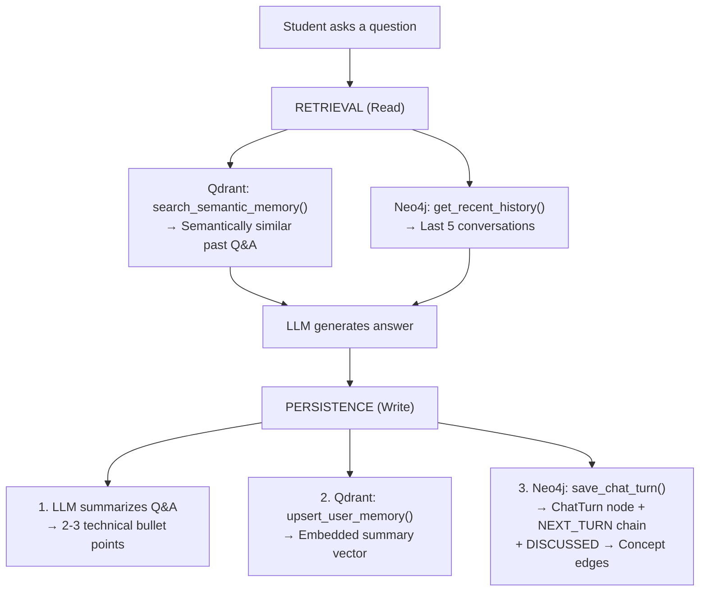
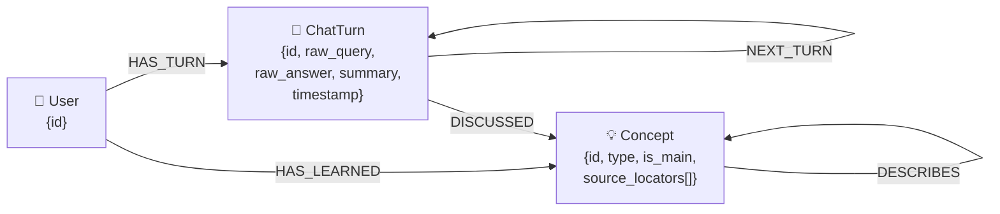

# AI PROFESSOR

**A Multi-Agent AI Professor powered by GraphRAG + Hybrid Memory**

RAG Expert Mentor is an intelligent tutoring system that ingests Markdown textbooks, automatically builds a knowledge graph, and delivers personalized, step-by-step lectures through a team of specialized AI expert agents. It combines vector search (Qdrant), graph traversal (Neo4j), and a local LLM (Qwen 2.5 via Ollama) into a unified teaching platform with long-term memory.

---

## Table of Contents

- [Standout Features](#-standout-features)
- [Ideal Use Cases](#-ideal-use-cases)
- [Roadmap](#️-roadmap)
- [Tech Stack](#-tech-stack)
- [Architecture Overview](#-architecture-overview)
- [Data Ingestion Pipeline (AOT)](#-data-ingestion-pipeline-aot--ahead-of-time)
- [Learning Architecture](#-learning-architecture)
- [QA Architecture](#-qa-architecture-localqa--globalqa)
- [Hybrid Memory & Chat History Management](#-hybrid-memory--chat-history-management)
- [Agent Queue System](#-agent-queue-system)
- [Database Schemas](#-database-schemas)
- [Dependency Injection](#-dependency-injection)
- [Project Structure](#-project-structure)
- [Getting Started](#-getting-started)
- [Testing](#-testing)

---

## 🌟 Standout Features

### 1. Dual QA Engine: Search vs. Semi-Search
Unlike traditional RAG systems that treat all questions equally, AI Professor utilizes a dual-engine approach to optimize both latency and accuracy:
* **LocalQA (Semi-Search):** When a student asks a follow-up question during a specific lesson, the system does *not* query the entire vector database. Instead, it extracts the `anchor_nodes` of the current section and performs a **Reverse BFS (Breadth-First Search)** on the Neo4j graph. It traces back prerequisite knowledge and immediately related concepts, guaranteeing hyper-focused, hallucination-free answers.
* **GlobalQA (Full Search):** When asked a general or out-of-context question, the system falls back to a global search. It embeds the query, scans the Qdrant vector space for the closest semantic matches, and then pulls the macro-context from the graph.

### 2. Multi-Tenant Hybrid Memory (SSOT)
We solve the "ephemeral UI state" problem common in Streamlit apps. Neo4j acts as the **Single Source of Truth (SSOT)**. Every chat turn, lecture, and thought process is saved chronologically in Neo4j and semantically in Qdrant, partitioned securely by `user_id`. If you refresh the page or switch lessons, the UI lazily loads the exact historical state from the database.

### 3. Ahead-of-Time (AOT) Agent Routing
Instead of relying on an LLM to dynamically decide which agent to call at runtime (which adds massive latency), the ingestion pipeline pre-calculates the optimal sequence of expert agents (Concept, Math, Algorithm, Example) based on the structural properties of the markdown file. This ensures zero-latency routing during the actual teaching phase.

---

## 🎯 Ideal Use Cases

* **🎓 University Self-Study Companion:** Digest dense, heavy textbooks (like Machine Learning or Advanced Calculus) into structured, bite-sized conversational lessons.
* **🏢 Corporate Knowledge Transfer:** Ingest internal company wikis or standard operating procedures (SOPs) to train new onboarded employees interactively.
* **🧠 Personalized STEM Tutor:** A tutoring system that actually remembers what you struggled with 5 lessons ago and adapts its current explanations based on your graph-linked episodic memory.

## 🛣️ Roadmap
- [x] Multi-Agent Pipeline & AOT Routing
- [x] Neo4j + Qdrant Hybrid Memory
- [x] Multi-tenant UI State Synchronization
- [ ] **Multi-modal Ingestion:** Support for PDFs with images and diagrams.
- [ ] **Web Grounding:** Allow the GlobalQA agent to search the web for concepts not found in the textbook.
- [ ] **RAGAS Evaluation:** Implement automated metrics to measure faithfulness and answer relevancy.

---

## 🛠 Tech Stack

| Component | Technology |
|---|---|
| **LLM** | Qwen 2.5 7B (local via Ollama) |
| **LLM Framework** | LangChain (prompts, streaming, chat models) |
| **Vector DB** | Qdrant (Named Vectors, `paraphrase-multilingual-MiniLM-L12-v2`, dim=384) |
| **Graph DB** | Neo4j 5.20 + APOC plugin |
| **Embedding** | FastEmbed (`sentence-transformers/paraphrase-multilingual-MiniLM-L12-v2`) |
| **Frontend** | Streamlit |
| **DI Container** | `dependency-injector` (DeclarativeContainer) |
| **Config** | `pydantic-settings` (`.env` support) |
| **Containerization** | Docker Compose |

---

## Architecture Overview


The system is organized into **5 architectural layers**:

1. **Frontend** — Streamlit UI with 2 workspaces (Learning + Global Q&A)
2. **Runtime** — `RuntimeEngine` dispatches to `QueueOrchestrator` (teaching) or `SupportAgent` (Q&A)
3. **Orchestrator** — `LLMService` handles AOT extraction; `LLMFactory` abstracts LLM providers
4. **Database** — `QdrantVectorStore` (semantic search) + `Neo4jManager` (graph traversal)
5. **Core** — DI Container, ABC interfaces, Pydantic schemas, centralized settings

---

## Data Ingestion Pipeline (AOT — Ahead-Of-Time)

When a user uploads a `.md` textbook, the system performs a **single-pass AOT extraction** that pre-computes everything needed for runtime:


### What the Single-Pass LLM Extracts

For each section, one LLM call produces **3 structured artifacts**:

| Artifact | Description | Stored In |
|---|---|---|
| **Main Entities** | Primary concepts/objectives of the section | Neo4j (`Concept` nodes with `is_main=true`) |
| **Teaching Roadmap** | 2–4 teaching steps, each with a `required_agents` queue | Qdrant (`curriculum_group` points with deterministic UUID5) |
| **Knowledge Graph** | Typed nodes + typed edges (PREREQUISITE_OF, RELATES_TO, PART_OF, DESCRIBES) | Neo4j (merged `Concept` nodes with `source_locators[]`) |

### Cross-Section Graph Linking

A **global node accumulator** tracks all previously extracted concepts. When processing a new section, the LLM is given the existing node list and instructed to:
- Reuse exact names for matching/synonymous concepts
- Create cross-section edges when relationships are detected

### HyDE (Hypothetical Document Embeddings)

After roadmap extraction, the LLM generates 5 hypothetical FAQ questions per section. These questions are embedded and stored as **child vectors** pointing to their parent section — serving as semantic bridges that dramatically improve retrieval accuracy when students ask questions in natural language.

---

## Learning Architecture

The Learning flow delivers **structured, sequential lectures** using a pre-compiled agent queue.


### Detailed Flow

1. **Macro-Context**: Retrieves the full original section text from Qdrant
2. **Graph State**: Queries Neo4j to determine which prerequisites the user has/hasn't learned
3. **Agent Queue**: Executes each expert agent in the pre-defined order (AOT-determined)
4. **Scratchpad**: Each agent writes its output to a partitioned memory buffer (concept/math/formula/algorithm/dynamic)
5. **Global Summary**: After each agent completes, a one-sentence summary is appended to `global_summary` for the next agent to read
6. **Save Lecture**: Full accumulated lecture text is saved to Qdrant (semantic memory) and Neo4j (episodic memory + multi-concept linking)
7. **Mark Learned**: Creates `HAS_LEARNED` relationship in Neo4j for the user

### Key Design Decisions

- **Macro vs. Micro Context**: Each agent receives the *full section text* (macro) but is instructed to focus only on the specific `content_focus` (micro). This ensures coherent, contextual explanations.
- **Graph-Aware Teaching**: Agents adapt their lectures based on the user's graph state — briefly explaining unlearned prerequisites and referencing learned ones.
- **Scratchpad Isolation**: Each agent type writes to its own buffer, preventing cross-contamination while maintaining intra-type continuity.
- **Global Summary Chain**: After each agent finishes, its output is compressed into a single sentence and appended to `global_summary`, giving subsequent agents awareness of what has already been covered.

---

## QA Architecture (LOCAL_QA & GLOBAL_QA)

The QA system implements the **Dual Engine** described in [Standout Features](#-standout-features): **Reverse BFS** for LocalQA and **Full Vector Search** for GlobalQA, both backed by Hybrid Memory Retrieval + Self-Routing.

### LOCAL_QA vs. GLOBAL_QA

| Aspect | LOCAL_QA | GLOBAL_QA |
|---|---|---|
| **Strategy** | Reverse BFS on Neo4j graph | Full vector search on Qdrant |
| **Scope** | Filtered by current `target_file` | Entire knowledge base |
| **Neo4j Traversal** | `semi_search` (1-hop backwards) | `search` (2-hop undirected) |
| **Use Case** | "What does this formula mean?" | "Compare Graph DB vs Vector DB" |

### QA Flow (Both Modes)


### HyDE Search + LLM Reranking

The QA retrieval pipeline uses a **2-stage approach**:

1. **Vector Search**: The user's query is embedded and matched against the HyDE question collection (child vectors). This finds questions semantically similar to what the user is asking.
2. **LLM Reranking**: The top-5 candidate questions are sent to the LLM, which selects the best semantic match and returns its `parent_id`. The parent section's full text is then fetched from Qdrant.

This approach avoids the "vocabulary mismatch" problem where student questions use different terminology than the textbook.

---

## 🧠 Hybrid Memory & Chat History Management

The system implements a **3-layer memory architecture** inspired by cognitive science:

### Memory Layers

| Layer | Stored In | Query Method | Purpose |
|---|---|---|---|
| **Semantic Memory** | Qdrant (`user_memory_v1`) | Vector similarity search | Find semantically related past Q&A |
| **Episodic Memory** | Neo4j (`ChatTurn` chain) | Chronological traversal | Recent history + raw text retrieval |
| **Knowledge Graph** | Neo4j (`Concept` nodes) | Cypher graph traversal | Relationships between concepts |

### Chat History Lifecycle



### Self-Routing: The `fetch_raw` Mechanism

The most distinctive feature of the QA system is **self-routing**:

1. The LLM first receives only **summaries** of past conversations (lightweight context).
2. If the summaries lack sufficient detail to answer the question, the LLM **autonomously returns** `{"action": "fetch_raw", "turn_ids": [...]}`.
3. The engine fetches the **full raw text** of the specified turns from Neo4j.
4. The LLM is re-invoked with the raw details injected, producing a comprehensive answer.

This design minimizes context window usage in the common case while preserving the ability to access full conversation history when needed.

---

## 🤖 Agent Queue System

### Available Expert Agents

| Agent | Specialty | System Prompt Focus |
|---|---|---|
| `concept` | Intuition & metaphors | Explain the "why" using analogies |
| `formula` | Formal syntax & LaTeX | Define variables, state formulas precisely |
| `math` | Rigorous proofs | Step-by-step logical derivations |
| `algorithm` | Computational logic | Pseudo-code, flowcharts, complexity |
| `example` | Practical application | Concrete numerical/real-world examples |
| `dynamic:<role>` | Custom expertise | User-defined role (e.g., `dynamic:historian`) |

### Scratchpad Architecture

```
QueueState
├── current_step_id: str
├── macro_context: str      ← Full section text (shared, read-only)
├── graph_context: str      ← Learned/Unlearned prerequisites
├── global_summary: str     ← Compressed chain of all agents' outputs
├── concept_scratchpad: []  ← Concept agent's private memory
├── math_scratchpad: []     ← Math agent's private memory
├── formula_scratchpad: []  ← Formula agent's private memory
├── algorithm_scratchpad: [] ← Algorithm agent's private memory
└── dynamic_scratchpad: []  ← Dynamic/Example agent's shared memory
```

Each agent receives its own scratchpad for intra-type continuity and the shared `global_summary` for inter-agent awareness.

### Queue Mutation

The orchestrator supports **runtime queue mutation** via `mutate_queue()`, which pushes new agents to the front of the queue. This enables dynamic agent injection when knowledge gaps are detected.

---

## 💾 Database Schemas

### Qdrant Collections

| Collection | Content | Point ID Strategy |
|---|---|---|
| `math_curriculum_v4` | Section anchors + Curriculum groups | MD5 hash (sections), UUID5 (curriculum) |
| `math_curriculum_v4_questions` | HyDE hypothetical questions | UUID5 (`{parent_id}_q_{idx}`) |
| `user_memory_v1` | Episodic Q&A summaries per user | UUID4 (turn_id) |

All collections use **Named Vectors** with the key `fast-paraphrase-multilingual-minilm-l12-v2` (384 dimensions, cosine distance).

### Neo4j Graph Schema



### Neo4j Relationship Types

| Relationship | From → To | Description |
|---|---|---|
| `HAS_LEARNED` | User → Concept | Tracks learning progress |
| `HAS_TURN` | User → ChatTurn | Links user to their conversations |
| `NEXT_TURN` | ChatTurn → ChatTurn | Chronological chain |
| `DISCUSSED` | ChatTurn → Concept | Links conversation to topic |
| `PREREQUISITE_OF` | Concept → Concept | Dependency ordering |
| `RELATES_TO` | Concept → Concept | Semantic association |
| `PART_OF` | Concept → Concept | Compositional hierarchy |
| `DESCRIBES` | Concept → Concept | Descriptive link |

---

## 🔧 Dependency Injection

The `Container` (using `dependency-injector`) wires the entire system as singletons:

```
Container
├── config              ← Settings (from .env via pydantic-settings)
├── vector_db           ← QdrantVectorStore
├── graph_db            ← Neo4jManager
├── primary_llm         ← ChatOpenAI (temp=0.0, JSON mode) → Extraction
├── chat_llm            ← ChatOpenAI (temp=0.3, free-form) → Streaming
├── qa_llm              ← ChatOpenAI (temp=0.3, JSON mode) → QA routing
├── llm_service         ← LLMService(primary_llm, chat_llm)
├── support_agent       ← SupportAgent(qa_llm)
├── queue_orchestrator  ← QueueOrchestrator(llm_service)
└── runtime_engine      ← RuntimeEngine(orchestrator, vector_db, graph_db, support_agent)
```

Three separate LLM instances serve different purposes:
- **primary_llm** (temp=0.0, JSON mode): Deterministic extraction during ingestion
- **chat_llm** (temp=0.3, free-form): Creative streaming for lectures
- **qa_llm** (temp=0.3, JSON mode): Structured QA routing decisions

---

## 📁 Project Structure

```
rag-expert-mentor/
├── main.py                          # Streamlit app entry point
├── config/
│   └── settings.py                  # pydantic-settings configuration
├── core/
│   ├── container.py                 # Dependency Injection container
│   ├── interfaces.py                # ABC contracts (ILLMService, IVectorStore, IGraphStore)
│   ├── schemas.py                   # Pydantic models (TeachingStep, QueueState, QAResponse)
│   └── data_ingestion.py            # AOT ingestion pipeline
├── database/
│   ├── document_processor.py        # Markdown header splitter + TOC builder
│   ├── structural_db.py             # QdrantVectorStore (3 collections)
│   ├── semantic_dag.py              # Neo4jManager (Knowledge Graph + Chat History)
│   └── tocs/                        # Generated TOC JSON files
├── orchestrator/
│   ├── llm_factory.py               # LLM provider factory (Ollama/OpenAI/Gemini)
│   └── llm_service.py               # LLM extraction service (curriculum, DAG, HyDE, rerank)
├── runtime/
│   ├── engine.py                    # RuntimeEngine + SupportAgent
│   └── queue.py                     # QueueOrchestrator (agent execution + streaming)
├── data/                            # Sample markdown textbooks
├── tests/
│   ├── test_hybrid_memory_flow.py   # E2E multi-turn + fetch_raw test
│   └── test_graph_memory.py         # Graph memory integration test
├── docker-compose.yml               # Qdrant + Neo4j containers
├── requirements.txt                 # Python dependencies
└── .env                             # Environment variables
```

---

## 🚀 Getting Started

### Prerequisites

- Python 3.10+
- Docker & Docker Compose
- Ollama with `qwen2.5:7b` model pulled

### 1. Start Infrastructure

```bash
docker-compose up -d
```

This launches:
- **Qdrant** on `localhost:6333` (HTTP) and `6334` (gRPC)
- **Neo4j** on `localhost:7474` (Browser) and `7687` (Bolt)

### 2. Install Dependencies

```bash
pip install -r requirements.txt
```

### 3. Configure Environment

Create a `.env` file (or use the existing one):

```env
LLM_PROVIDER=ollama
LLM_MODEL_NAME=qwen2.5:7b
LLM_BASE_URL=http://localhost:11434/v1
QDRANT_HOST=localhost
QDRANT_PORT=6333
NEO4J_URI=bolt://localhost:7687
NEO4J_USER=neo4j
NEO4J_PASSWORD=ExpertMentor2026
```

### 4. Pull the LLM Model

```bash
ollama pull qwen2.5:7b
```

### 5. Run the Application

```bash
streamlit run main.py
```

---

## 📊 S
ystem Performance & Evaluation

The system was rigorously evaluated using industry-standard RAG metrics (RAGAS) and a custom Pedagogical Audit for Learning Mode.

### 🎯 QA Performance (RAGAS)
Evaluated on a dataset of complex questions spanning the entire textbook. The system achieved a state-of-the-art **0.902 Average Score** using local Qwen2.5-7B.

| Metric | Score | Insight |
| :--- | :--- | :--- |
| **Faithfulness** | **0.964** | Extremely high grounding; minimal hallucinations. |
| **Context Precision** | **0.921** | HyDE + LLM Reranking successfully identifies relevant data. |
| **Context Recall** | **0.821** | Multi-parent retrieval ensures comprehensive context coverage. |
| **AVERAGE** | **0.902** | **Exceeds standard RAG benchmarks for local models.** |

### 🎓 Learning Mode Quality (Pedagogical Audit)
An LLM-as-Judge audit was performed on full generated teaching sessions to evaluate educational effectiveness.

| Criterion | Score | Result |
| :--- | :--- | :--- |
| **Pedagogical Depth** | **8/10** | Provides clear definitions and technical context. |
| **Concept Coverage** | **9/10** | Captures 100% of main entities defined in the section. |
| **Tone & Engagement** | **9/10** | Maintains a supportive, professional academic mentor persona. |
| **Coherence** | **10/10** | Logical flow from basic concepts to advanced examples. |
| **OVERALL QUALITY** | **9.0/10.0** | **High-quality, structured learning experience.** |

---

## 🧪 Testing

### End-to-End & Performance Tests

```bash
# 1. Functional: Multi-turn learning session with hybrid memory verification
pytest tests/test_hybrid_memory_flow.py::test_long_interactive_learning_session -s

# 2. Functional: Self-routing fetch_raw verification (Graph-driven)
pytest tests/test_hybrid_memory_flow.py::test_fetch_raw_interactive_session -s

# 3. Integration: Knowledge Graph connectivity and schema
pytest tests/test_graph_memory.py -s

# 4. Performance: RAGAS Evaluation (Faithfulness, Precision, Recall)
pytest tests/test_ragas_eval.py -s

# 5. Performance: Pedagogical Audit (Instructional Quality)
pytest tests/test_learning_eval.py -s

# 6. Analysis: Ablation Study (Hybrid vs. Vector-only Retrieval)
pytest tests/test_ablation_study.py -s
```

> **Note**: Tests require running Qdrant, Neo4j, and Ollama instances.

---

## License

This project is for educational and research purposes.
